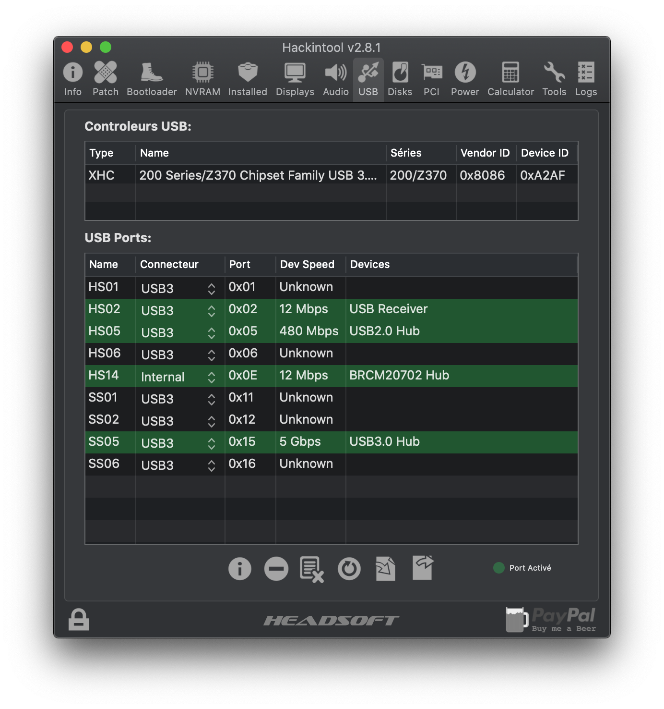

# Hackintosh z370 G Gaming

IN PROGRESS !

## Setup

- Motherboard: Asus Rog Strix z370 G Gaming
- Processor:  i7-8700k, with Delid :-)
- Ram:  2 x 16Go Crucial
- Disk: Nvm Samsung 950 EVO 512 Go
- Graphic Card: AMD 580 Sapphire
- Screen: 2x 4k Samsung displays
- Keyboard: Logitech Craft
- Mouse: Mx Master 1S
- Wifi + Bluetooth: BCM943602CS with PCI Adapter

## Overview

The Hackintosh is pretty stable. I spend a lot of time to make it stable. USB and Wifi
give me a lot of hard work to be stable ( wake up, transfert rate...) with iMac 18,3 or
iMac 19,2. iMac 1,1 seems to be the good choice. No UHD 630 Quick sync but no freeze
or wake issues.

I've switched to OpenCore since 2 week for Catalina upgrade. I'm really happy with this new configuration and the setup works like a charm on Catalina.

Just want to share my setup for other.

## Pre-requisites

- Hackintool, for usb and pci debug: http://headsoft.com.au/download/mac/Hackintool.zip
- Plist Editor Pro: https://www.fatcatsoftware.com/plisteditpro/PlistEditPro.zip

## Bios setting

1. Graphic, Above 4G, UEFI only, asus led display, Asmedia deactivation...

- Advanced\CPU - Power Management Control Option
  - Hyper Threadind: Enabled
  - Intel Virtualization Technology: Enabled
- Advanced\System Agent (SA) Configuration
  - Vt-d: Disabled
  - Above 4G Decoding: Enabled
- Advanced\System Agent (SA) Configuration\Graphics configuration
  - Primary Display: PCIE
  - iGPU Multi-Monitor: Disabled
- Advanced\Onboard Devices Configuration
  - Asmedia USB 3.1 Controller: Disabled
  - RGB LED lighting
    - When system is in working state:  Off
    - When system is in sleep, hibernate or soft off states: Off
- Boot
  - Fast Boot: Disabled
- Boot\CSM ( Compatibility Support Module)
  - Launch CSM: Disabled


## USB Mapping

I've been very restrictive in port mapping. This is due to my custom install
( Wooden pc case, integrated to the desktop).

The most important thing is to have les than 15 usb port ( Mac OS limit).
An USB 3 port consumes 2 port ( 1 for USB 2 and 1 for USB 3).

The port HS14 is internal and used by BCM943602CS Wifi,Bluetooth card. You
need to configured it as "internal" to avoid sleep issues.



## Opencore

## Post Install

### Mandatory
- Change Security, scan policy to ...
- In Catalina, deactivate in power saving "Reactivate on network access", it cause slow wifi after wake up, may a low power mode issue during wake: https://www.tonymacx86.com/threads/slow-wifi-after-sleep.174315

### Bonus

- Change the numpad "," key mapping to ".", for developper and linux boys:
```bash
mkdir -p ~/Library/KeyBindings
cat > ~/Library/KeyBindings/DefaultKeyBinding.dict <<EOF
{
   "#," = ("insertText:", ".");
}
EOF
```
## Reference

- https://www.tonymacx86.com/threads/pastrychefs-asus-rog-strix-z370-g-gaming-wi-fi-ac-build-w-i9-9900k-amd-vega-56.239969
- https://apple.stackexchange.com/questions/229509/apple-keyboard-remap-keypad-comma-to-dot
